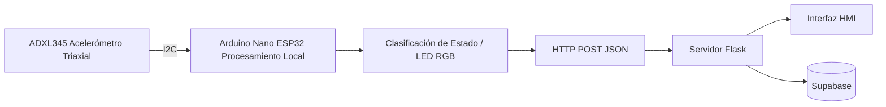
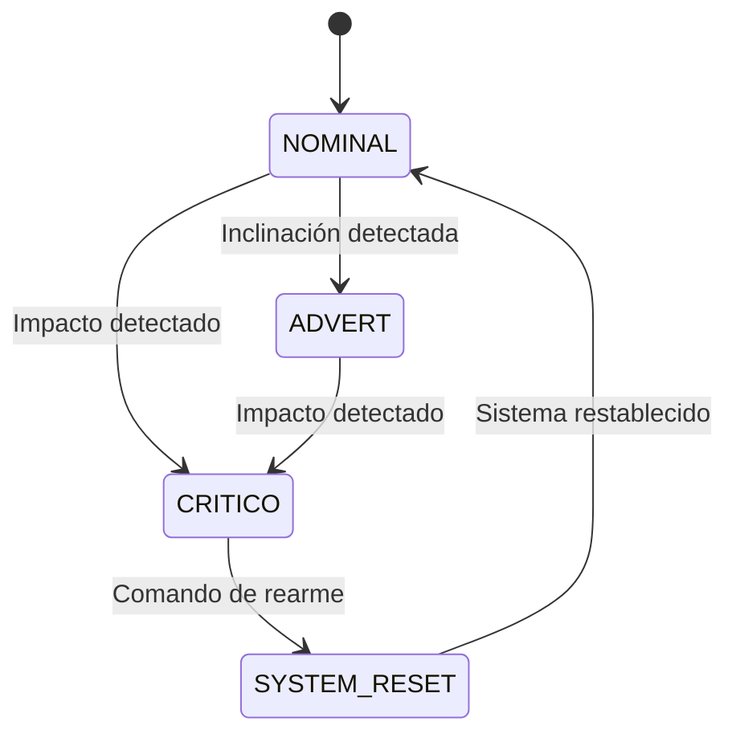
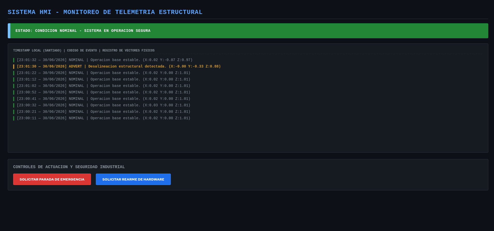
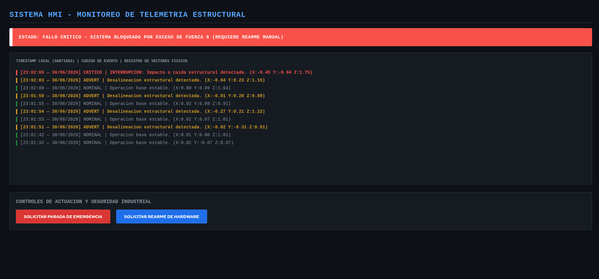
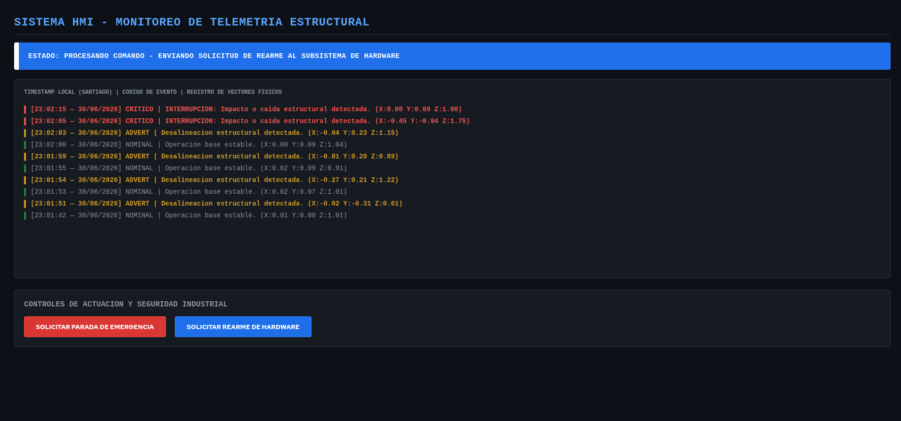
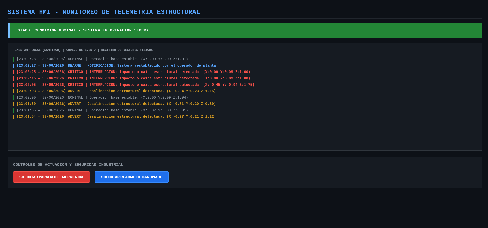

# Sistema de Monitoreo de Telemetría Industrial y Plataforma HMI

## Descripción General

Este proyecto implementa un sistema de monitoreo de telemetría para la supervisión de variables físicas mediante una arquitectura distribuida basada en un nodo de adquisición (Edge Computing) y una plataforma HMI centralizada.

El sistema adquiere información proveniente de un acelerómetro triaxial ADXL345 conectado a un Arduino Nano ESP32. Las mediciones son procesadas localmente para determinar el estado operativo del sistema y posteriormente transmitidas mediante el protocolo HTTP hacia un servidor desarrollado en Flask, donde son visualizadas por el operador y almacenadas en una base de datos Supabase para su trazabilidad.

La arquitectura implementada permite separar las funciones de adquisición, procesamiento, comunicación y supervisión, manteniendo la lógica de seguridad en el dispositivo embebido y utilizando el backend únicamente como plataforma de monitoreo y registro.

---

# Objetivos del Proyecto

## Objetivo General

Diseñar e implementar un sistema de monitoreo industrial capaz de adquirir variables físicas, clasificar estados operacionales y visualizar la información en una interfaz HMI mediante una arquitectura cliente-servidor.

## Objetivos Específicos

- Adquirir datos de aceleración utilizando un sensor ADXL345.
- Procesar las variables físicas mediante un Arduino Nano ESP32.
- Implementar comunicación inalámbrica mediante HTTP utilizando mensajes JSON.
- Visualizar el estado del sistema mediante una interfaz HMI desarrollada en Flask.
- Registrar eventos históricos en una base de datos Supabase.
- Generar indicadores luminosos locales mediante LEDs RGB para representar el estado operativo del sistema.

---

# Arquitectura del Sistema

La solución se divide en tres capas funcionales.

## 1. Capa de Adquisición y Procesamiento (Edge)

**Hardware utilizado**

- Arduino Nano ESP32
- Sensor ADXL345
- Indicadores LED RGB

**Funciones**

- Lectura continua del acelerómetro mediante comunicación I2C.
- Obtención de aceleraciones en los ejes X, Y y Z.
- Evaluación de condiciones de operación.
- Clasificación del estado del sistema.
- Control de los indicadores luminosos.
- Envío de telemetría hacia el servidor.

El procesamiento local permite reducir la latencia de respuesta y mantener el funcionamiento del sistema incluso si la comunicación con el servidor se interrumpe temporalmente.

---

## 2. Capa de Comunicación

La comunicación entre el nodo embebido y el servidor se realiza utilizando el protocolo HTTP.

**Características**

- Protocolo: HTTP
- Método: POST
- Formato de intercambio: JSON
- Medio físico: WiFi IEEE 802.11

El uso de HTTP permite una implementación sencilla, compatible con aplicaciones web desarrolladas en Flask y adecuada para el volumen de información generado por el sistema.

---

## 3. Plataforma de Supervisión (Backend + HMI)

La plataforma fue desarrollada utilizando Flask en Python.

Sus funciones principales son:

- Recepción de telemetría.
- Interpretación de estados.
- Actualización de la interfaz HMI.
- Registro histórico en Supabase.
- Supervisión remota del sistema.

Esta capa no participa directamente en las decisiones de seguridad del dispositivo, sino que proporciona capacidades de monitoreo, almacenamiento y trazabilidad de la información.

---

# Justificación de la Arquitectura

La arquitectura implementada responde al principio de separación de responsabilidades utilizado en sistemas de monitoreo industrial.

## Arduino Nano ESP32

El ESP32 cumple el rol de nodo de adquisición debido a que integra capacidad de procesamiento, conectividad WiFi y control de periféricos en un único dispositivo.

Su función principal es:

- adquirir las variables físicas;
- procesar las mediciones en tiempo real;
- determinar el estado operativo;
- controlar los indicadores físicos;
- transmitir la información al servidor.

De esta forma, las decisiones relacionadas con la seguridad permanecen cercanas al proceso físico, disminuyendo la dependencia de la red.

## Servidor Flask

El servidor centraliza la información enviada por el nodo embebido.

Su utilización permite:

- visualizar el estado del sistema;
- registrar eventos históricos;
- facilitar la supervisión remota;
- separar la lógica de monitoreo de la lógica de adquisición.

## Base de Datos Supabase

Supabase proporciona persistencia para los registros históricos generados durante la operación del sistema, permitiendo almacenar cada evento con su correspondiente información temporal para análisis posteriores.

---

# Flujo General de Información



---

# Modelo de Telemetría

Ejemplo de mensaje transmitido por el nodo:

```json
{
  "device_id": "ESP32_NODE_01",
  "timestamp": 1730000000,
  "ax": 0.12,
  "ay": -0.03,
  "az": 9.81,
  "state": "NOMINAL"
}
```

## Descripción de los campos

| Campo | Descripción |
|--------|-------------|
| device_id | Identificador del nodo ESP32 |
| timestamp | Marca temporal de la medición |
| ax | Aceleración eje X |
| ay | Aceleración eje Y |
| az | Aceleración eje Z |
| state | Estado operativo determinado por el firmware |

---

# Estados Operativos del Sistema

El sistema implementa un modelo de estados operativos que permite clasificar las condiciones de funcionamiento detectadas por el nodo ESP32. Cada estado genera una representación física mediante indicadores LED RGB y una representación digital en la interfaz HMI.



| Estado | Condición | Indicador RGB | HMI | Código |
|---------|-----------|---------------|-----|--------|
| Operación Nominal | Variables dentro del rango esperado | Verde continuo | Verde | `NOMINAL` |
| Advertencia | Inclinación detectada fuera del rango establecido | Amarillo continuo | Amarillo | `ADVERT` |
| Falla Crítica | Impacto o aceleración superior al umbral configurado | Rojo intermitente (200 ms) | Rojo | `CRITICO` |
| Rearme | Comando de reinicio emitido desde la HMI | Destello de transición | Azul | `SYSTEM_RESET` |

El estado **CRITICO** posee la mayor prioridad operativa. Una vez detectado un evento de impacto, el sistema permanece enclavado hasta recibir un comando de rearme desde la interfaz HMI.

---

# Registro y Visualización de Eventos

Cada mensaje recibido por el servidor es procesado y almacenado en Supabase.

La plataforma HMI permite visualizar en tiempo real:

- aceleraciones medidas;
- estado operativo del sistema;
- historial de eventos registrados;
- cambios de estado durante la operación.

Esta funcionalidad facilita la supervisión remota y la trazabilidad de los eventos detectados.

---

# Tecnologías Utilizadas

## Firmware

- Arduino Framework
- C++
- Arduino Nano ESP32
- ADXL345

## Backend

- Python
- Flask

## Base de Datos

- Supabase

## Comunicación

- HTTP
- JSON
- WiFi

---

# Cumplimiento de Restricciones Técnicas

El proyecto fue desarrollado respetando las restricciones establecidas para la evaluación.

- Firmware implementado en C++.
- Backend implementado exclusivamente en Python utilizando Flask.
- Comunicación mediante HTTP.
- Persistencia de datos utilizando Supabase.
- Separación entre procesamiento embebido y supervisión remota.

---

# Evidencia de Funcionamiento

## Estado de Operación Nominal

El sistema opera bajo condiciones normales. Las variables medidas por el acelerómetro se encuentran dentro de los rangos establecidos y no se detectan eventos de advertencia ni fallas. El indicador RGB permanece en color verde y la HMI muestra el estado **NOMINAL**.



---

## Estado de Falla Crítica

Se detecta un evento de impacto que supera el umbral configurado, activando el enclavamiento de seguridad. El indicador RGB cambia a rojo intermitente y la HMI muestra el estado **CRITICO**, notificando la condición de falla al operador.



---

## Solicitud de Rearme del Sistema

El operador solicita el restablecimiento del sistema desde la interfaz HMI. Durante este proceso se envía el comando **SYSTEM_RESET** al nodo ESP32 para liberar el enclavamiento de seguridad y reinicializar la lógica de operación.



---

## Sistema Restablecido

Una vez procesado correctamente el comando de rearme, el nodo ESP32 abandona el estado de falla, reestablece la operación normal y actualiza la interfaz HMI para indicar que el sistema ha sido recuperado y está nuevamente disponible para el monitoreo.



